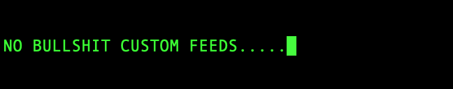

# BASIC FEED 

### OVERVIEW 

The aim of this project is to design and build a website that will stream feeds, letter by letter, line by line in ticker fasion constantly updating dynamically scrolling as page fills up. 

## REQUIREMENTS 

**THEME**  
  
- Minamilistic 
- Black background
- Green text

Stretch goal: Allow user to customise theme 

**FEED**  
  
- Default feed will be from some alternate impartian news sites 
- Option to include public tweets, reddit posts, weather, crypto prices etc

## STRATEGY 

1. Agree upon overall framework
2. Agree upon hosting strategy, cost etc
3. Design MVP for bare bones usage
4. Initial process to trial with dummy text from file 
5. Improve upon by adding a single news feed etc  

## DESIGN 

Under consideration - WP to allow ease of php and login. 
Could build code in Flask webserver - issue is this can not be scaled, not designed for this but allows rapid prototyping. 